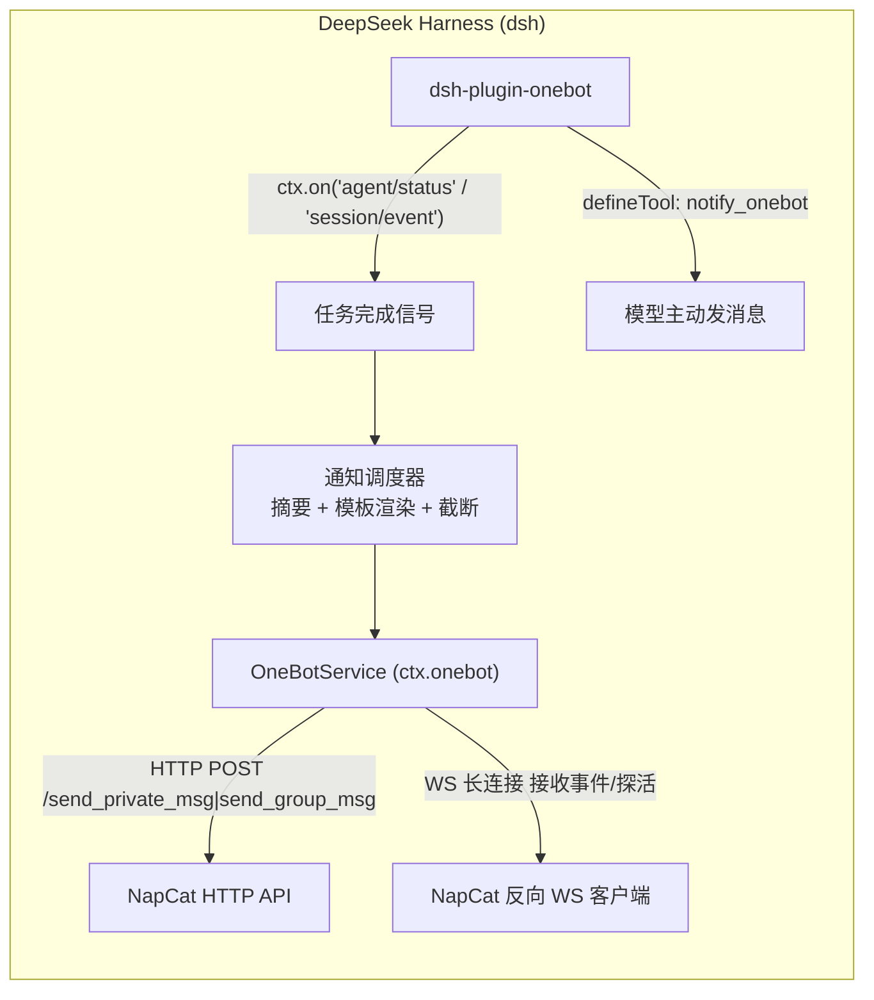

# dsh-plugin-onebot

DeepSeek Harness（`dsh`）插件：**任务完成后，通过 OneBot（NapCat / go-cqhttp / Lagrange 等）通知指定的 QQ 用户或群组**。

采用「**WS 长连接 + HTTP 执行行为**」的 OneBot 接入方式：

- **WS 长连接**（默认 `server` 模式）：插件作为 WebSocket 服务端，等 NapCat 的「反向 WebSocket 客户端」接入，用于接收事件、心跳探活、判断机器人是否在线；也可切换 `client` 模式主动连接，或 `off` 关闭。
- **HTTP 执行行为**：调用 OneBot v11 HTTP API（`send_private_msg` / `send_group_msg` / `send_msg` 等）实际发送通知，支持 `Authorization: Bearer` 鉴权、超时与指数退避重试。

## 特性

- 任务完成自动通知：默认监听 `agent/status`（agent 转为 `idle` = 整个任务干完）通知一次；可切换 `notifyOn: 'turn'` 逐回合通知。
- 只通知完成/出错结果（`notify.onError` 控制是否通知出错），默认跳过子 agent（subagent）避免重复通知。
- 通知模板：支持 `{sessionId}` `{summary}` `{status}` `{time}` 占位符；摘要自动取最后一条 assistant 文本并按 `maxLength` 截断。
- 模型可主动调用 `notify_onebot` 工具，把结果推给指定用户/群，支持 CQ 码（如 `[CQ:at,qq=123]`）。
- 以 Service（`ctx.onebot`）形式提供，其他插件可复用。
- **GUI 配置页**：Web UI「设置 → 插件 → Configurable」里可直接编辑全部配置（HTTP / WS / 通知目标），保存即写入 `settings.yaml`，notify/http 改动即时生效。

## 目录结构

```
dsh-plugin-onebot/
├── package.json        # npm 包清单 + dsh.bundle / dsh.client 声明 + prepare 构建脚本
├── tsconfig.json       # 严格模式类型检查配置（tsc --noEmit）
├── tsdown.config.ts    # 构建配置：Node 库（lib/）+ 浏览器 client bundle（lib/client.js）
├── cordis.patch.yml    # bundle 配置层：插入插件行
├── dev/cordis.yml      # 本地开发 overlay（只加载 host 半边，见「本地开发」）
├── src/
│   ├── index.ts        # 主插件：Config schema + settings 命名空间 + 事件监听 + 工具
│   ├── service.ts      # OneBotService（ctx.onebot）：WS 长连接 + HTTP 行为
│   ├── client.ts       # 浏览器半边：设置页里的可点击配置卡片（settings.plugin.item 插槽）
│   ├── notify.ts       # 摘要提取 / 模板渲染 / 截断（对外最小结构类型）
│   └── types.ts        # 配置类型
└── test/smoke.mjs      # 冒烟测试（含 settings 接线单测）
```

## 架构



## 安装

```sh
# 本地目录
dsh plugin --profile demo add /path/to/dsh-plugin-onebot

# 或从 GitHub 安装（会拉源码并自动构建 lib/）
dsh plugin --profile demo add github:you/dsh-plugin-onebot
```

安装后验证配置层并启动：

```sh
dsh --profile demo --dump-config   # 应看到 "# == dsh-plugin-onebot" 层
dsh --profile demo
```

> 想看/编辑 GUI 配置卡片，需要安装进带完整界面的 `web` profile（`dsh plugin --profile web add ...`），见「配置页（GUI 设置）」。

## NapCat 配置

在 NapCat WebUI 的「网络配置」中，按你选定的 `ws.mode` 配置其中一套（HTTP 服务器两者都要开）：

### 方式 A：`ws.mode: client` —— 插件连 NapCat 正向 WS（NapCat 是 WebSocket Server）

1. **HTTP 服务器**：开启，端口如 `3000`（与插件 `http.url` 一致）；token 填到插件 `http.token`。
2. **WebSocket 服务器（正向 WS）**：新建一条，端口如 `3001`（与插件 `ws.port` 一致）；token 填到插件 `ws.token`。
   - 插件以 `client` 模式主动连接 `ws://<NapCat 机器 IP>:3001/ws`（`ws.host` / `ws.path` 保持一致，同机可用 `127.0.0.1`）。
   - 连接成功后插件日志（`verbose: true`）显示 `WS connected to ...`，并会收到 NapCat 的 `lifecycle/connect` 事件。

### 方式 B：`ws.mode: server` —— 插件做 WS 服务端，等 NapCat 反向 WS 连入（默认）

1. **HTTP 服务器**：同上。
2. **WebSocket 客户端（反向 WS）**：新建一条，地址填 `ws://<dsh 所在机器 IP>:8080/ws`（与插件 `ws.port` / `ws.path` 一致；dsh 与 NapCat 同机可用 `127.0.0.1`）；token 与插件 `ws.token` 一致。
   - 连接成功后插件日志显示 `WS client connected`。

> 两种方式任选其一即可；HTTP 行为（发消息）始终走 HTTP API，与 WS 方向无关。

## dsh 配置

安装后，在 profile 的 `cordis.yml` 里覆盖默认配置（不写则用默认值）：

```yaml
plugins:
  dsh-plugin-onebot:
    http:
      url: http://127.0.0.1:3000   # NapCat HTTP API 地址
      token: ''                     # 与 NapCat HTTP token 一致；留空不携带
      timeoutMs: 10000
    ws:
      mode: server                  # server | client | off
      host: 0.0.0.0                 # server 模式监听地址
      port: 8080                    # server 模式监听端口
      path: /ws                     # WS 路径，NapCat 反向 WS 地址要一致
      token: ''                     # 与 NapCat 反向 WS token 一致；留空不鉴权
      reconnectInterval: 3000       # 仅 client 模式断线重连间隔(ms)
    notify:
      notifyOn: idle                # idle：整个任务完成通知一次；turn：逐回合通知
      onError: true                 # 出错时也通知
      includeSubagents: false       # 是否包含子 agent 完成事件
      targets:                      # 默认通知目标
        - type: private             # private = QQ 号
          id: '10001'
        - type: group               # group = 群号
          id: '20002'
      template: '【任务完成】\n会话: {sessionId}\n状态: {status}\n\n{summary}'
      maxLength: 2000
      retries: 3                    # HTTP 失败重试次数（指数退避）
      retryDelayMs: 1000
      verbose: false                # 调试日志
```

> 注意：`targets` 为空时自动通知会跳过（避免误发），但 `notify_onebot` 工具仍可用显式 `targetId` 发送。

## 配置页（GUI 设置）

配置已接线到 dsh 的 settings 命名空间 `dsh-plugin-onebot`（host 半边 `src/index.ts` 用
`installSettingsSection` 注册，浏览器半边 `src/client.ts` 在 `settings.plugin.item` 插槽渲染卡片）。
在 Web GUI（`dsh web`，默认 `http://127.0.0.1:3080`）左下角 **设置 → 插件 → Configurable**，
应看到一张 `dsh-plugin-onebot` 卡片，分三段：

- **HTTP 连接**：`url` / `token` / `timeoutMs`
- **WS 长连接**：`mode` / `host` / `port` / `path` / `token` / `reconnectInterval`
- **通知设置**：`notifyOn` / 消息模板 / 长度限制 / 重试 / 通知目标列表（可增删私聊/群聊）

保存后：

- `notify.*` 与 `http.*` 改动**即时生效**（host 通过配置 thunk 实时读取）；
- `ws.*` 连接参数在**下次启动**时生效（避免频繁断连重连）；
- 想恢复某个分段的默认值，点该段标题右侧的「重置本节」。

> ⚠️ **harness 一次性设置（必读）**：卡片能否显示还取决于 harness 的
> `packages/host/apiproxy/src/api-proxy.ts` 里 `WEB_SETTINGS_NAMESPACES` 白名单——
> 不在名单里的命名空间，即使插件注册了，`settings.describe` 也会当它"not exposed"，
> 卡片因此不渲染。需要在你的 harness 检出里加一行：

```ts
const WEB_SETTINGS_NAMESPACES = [
  'agent-loop', 'shell', 'locale', 'permission', 'ui-conversation', 'ui-theme', 'web-search-deepseek',
  'dsh-plugin-template', 'dsh-plugin-onebot',   // ← 加 dsh-plugin-onebot
] as const
```

> 这是 harness 当前的注册决策点，更新/重装 harness 检出新代码后会丢失，需要重新加。
> 另外 client 半边只在插件以**包名**安装进 profile 时加载（`dsh plugin --profile web add ...`），
> `--patch` 源码路径挂载不会加载配置卡片。

## notify_onebot 工具

任务过程中/结尾，模型可主动调用：

```json
{
  "message": "任务完成，结果见附件 [CQ:at,qq=10001]",
  "targetType": "group",
  "targetId": "20002"
}
```

`targetType` / `targetId` 可省略，省略时发给配置的默认目标。

## 本地开发

```sh
pnpm install
pnpm typecheck
pnpm build
node test/smoke.mjs
```

在 deepseek-harness 源码根目录用 overlay 直接加载本仓库源码（免安装、免构建）：

```sh
pnpm dsh web --patch /absolute/path/to/dsh-plugin-onebot/dev/cordis.yml
```

（`dev/cordis.yml` 里的 `name` 是绝对路径，需改成你机器上的实际路径。）

> ⚠️ `--patch` overlay 只加载 **host 半边**（模块解析到源码文件，发现不了包级的
> `dsh.client` 声明），所以配置卡片不会出现。要测试浏览器半边的卡片，必须把包按
> **包名**安装进带 GUI 的 `web` profile：

```sh
pnpm dsh plugin --profile web add /absolute/path/to/dsh-plugin-onebot && pnpm dsh web
```

> 并且要确保 harness 的 `WEB_SETTINGS_NAMESPACES` 白名单里有 `dsh-plugin-onebot`
> （见「配置页（GUI 设置）」），否则卡片不渲染。

## 发布

- **npm**：`pnpm publish`（`files` 已包含构建产物与补丁）
- **tarball**：`pnpm pack`，用户 `dsh plugin --profile demo add ./dsh-plugin-onebot-0.1.0.tgz`
- **git**：`dsh plugin add github:you/dsh-plugin-onebot`（pnpm ≥10 首次安装 git 依赖会拒绝执行 prepare，按提示把包名加入 profile 的 `pnpm-workspace.yaml` 的 `allowBuilds` 后重试）

## 相关文档

- [插件开发入门](https://github.com/deepseek-ai/deepseek-harness/blob/main/docs/user/develop/basic/index.zh.md)
- [插件配置](https://github.com/deepseek-ai/deepseek-harness/blob/main/docs/user/develop/basic/config.zh.md)
- [事件系统](https://github.com/deepseek-ai/deepseek-harness/blob/main/docs/user/develop/framework/events.zh.md)
- [OneBot v11 协议](https://github.com/botuniverse/onebot-11)
